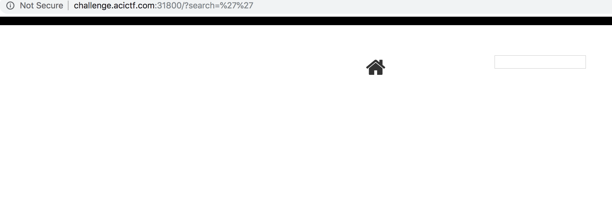
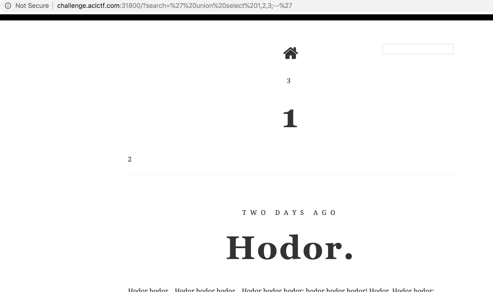
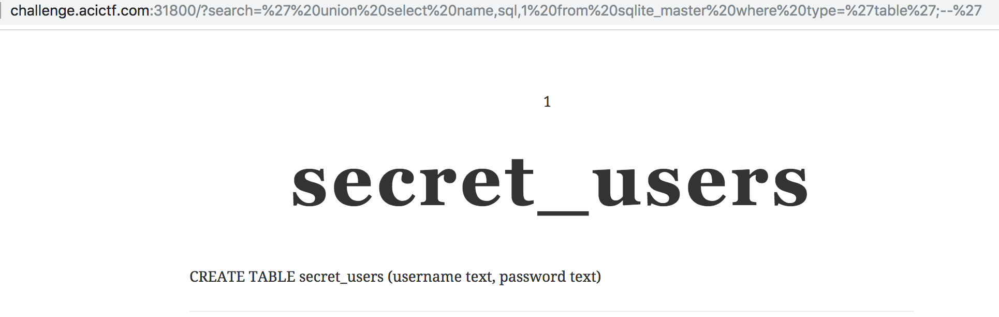

# Blog - Points: 30

### Description:

Get the admin password from this [website](http://challenge.acictf.com:31800/).

### Hints

 - Not much you can do except search.
 - Explore the database.
 - The blog is using sqlite.

### Solution

The hints pretty much give this one away.

Lets try to shove a sqli into the search field.

`http://challenge.acictf.com:31800/?search=%27`

returns a 500 error.

`http://challenge.acictf.com:31800/?search=%27%27`

seems to return a page without errors, but with messed up search results.

Alright, now let's enumerate the amount of columns that we need to return so that we don't cause errors.

Alrighty, it looks like we need 3 columns. Now let's begin enumerating the database. The hints tell us that this is sqlite, so that's the syntax we will use.

Using the injection: `' union select name,sql,1 from sqlite_master where type='table';--'`, we get the names of the tables reflected to the page. This one looks interesting:

Using the injection: `'union select username,password,1 from secret_users;--'`, we win.

### Flag: `ACI{56ed3fee80b3bdae097342edbe0}`

