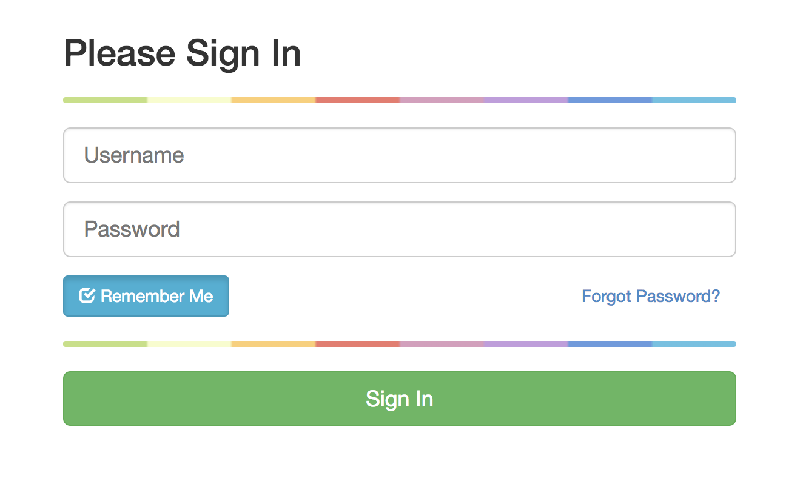
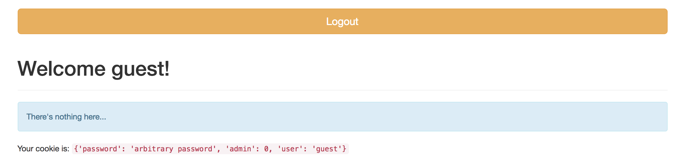
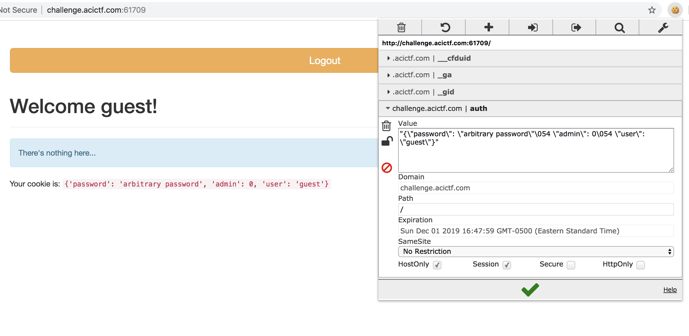
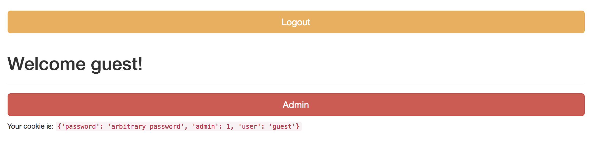

# Cooking 1 - Points: 10

### Description:

Welcome to the Throwback Category. Here we have pulled together some of our favorite intro challenges from previous CyberStakes. These are a great place for beginners to start.
[Web]

Hack [this website](http://challenge.acictf.com:61709/). We are told that guest accounts are enabled.

### Hints

Become admin.
Can you change the value of admin in your cookie?

### Solution

You are presented with a login form when visiting the website.

The description said that guest accounts are enabled. That generally means that you can login with the username `guest` or `anonymous` and any password. It turns out, this is the case here.

Upon logging in, we see a welcome message and (presumably) our cookies displayed on the page.

It's good practice to not just blindly trust things, so I always verify. There are a number of ways to check your cookies for a site. Chrome has a browser plugin called `EditThisCookie` that not only lets you view your cookies, but also allows you to edit them.

At this point, it seems pretty intuitive to change your admin value from 0 to 1 and click the big green checkmark. This will save your changes.

Then, simply refresh the page.

You are now presented with a large admin button.

Click on that big button, and win.

### Flag: `ACI{041e360abac24f5c9d2518a7057}`

