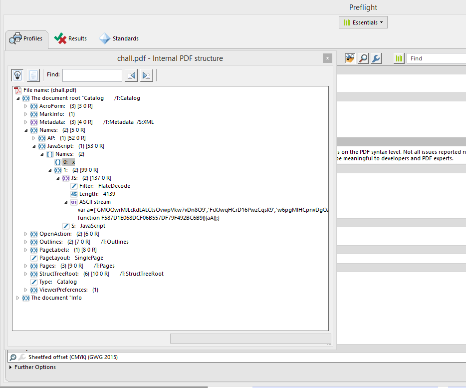
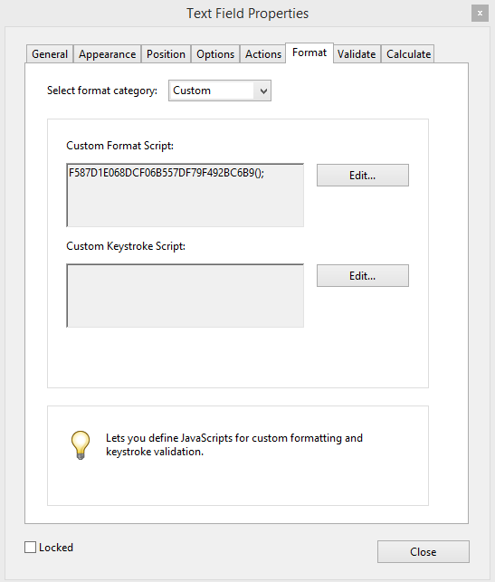
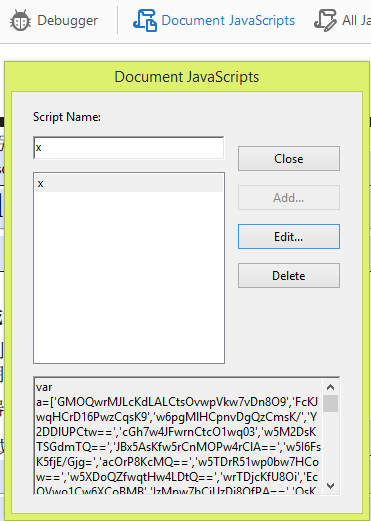
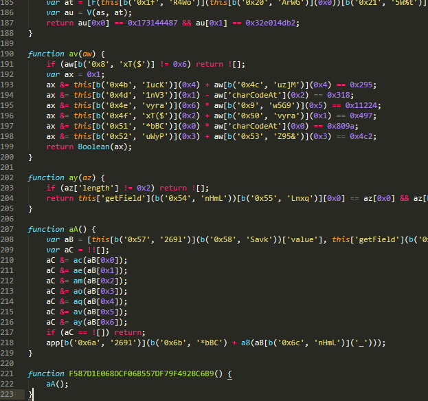
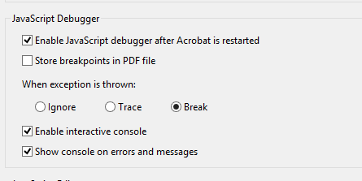
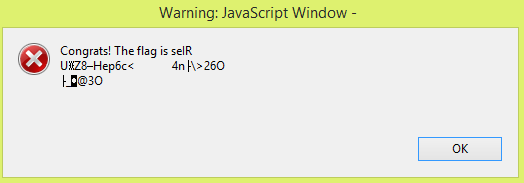
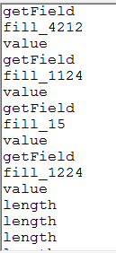
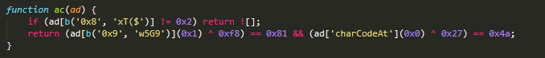
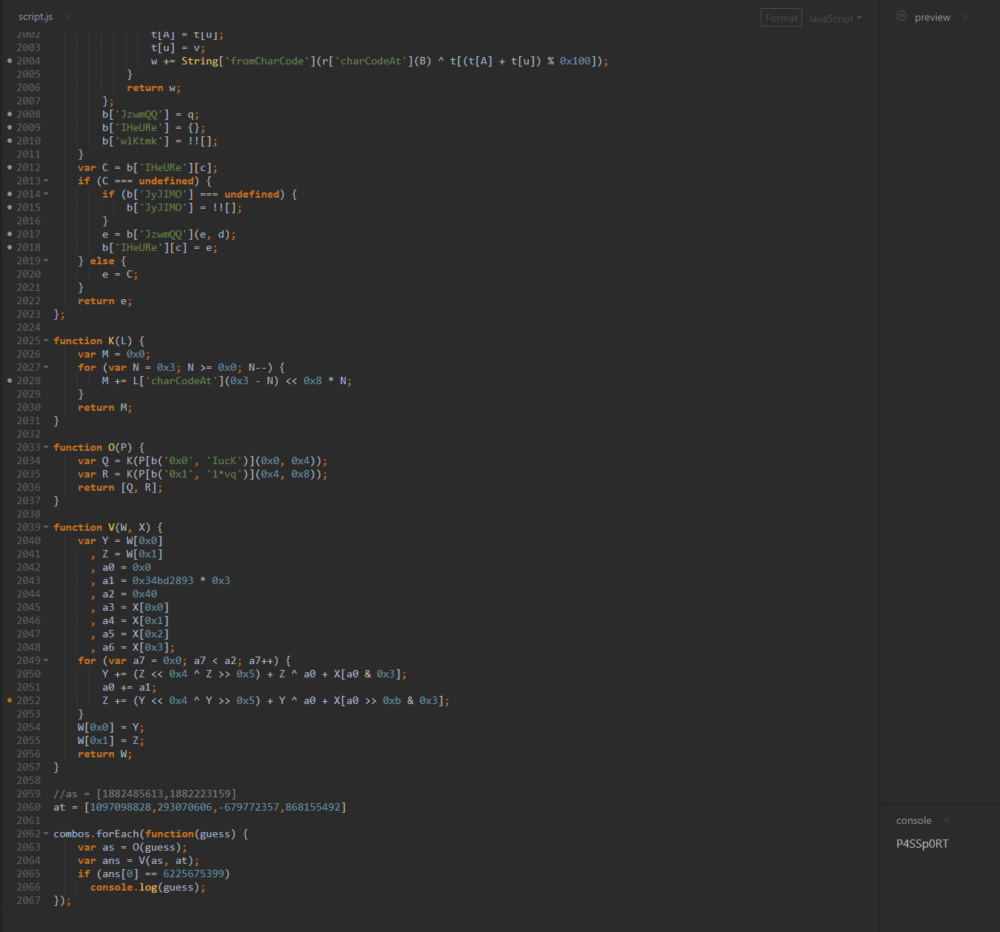
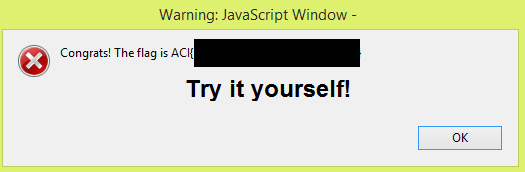

# Do(n't) cross the streams! - Points: 300

## Finding the Script
For this challenge, I ended up starting a 7-day free trial for Adobe Acrobat Pro, knowing this would probably be the best toolset for solving this challenge. I am curious if someone was able to use a free tool to solve this (specifically, for debugging the JavaScript); please message me if so.
During the CTF, I used the clue about JavaScript to find the script and begin unravelling it. In doing this writeup, I was curious where I could find this script independently. It seems the Preflight tool is the answer within the Adobe suite; this allows you to view the internal document structure.

Another way you could determine something was up is to check out the form fields and see that some of them have a custom script for “formatting”.

Regardless, the hint about JavaScript was there so I immediately set to work with the JavaScript tool within Acrobat. The script itself is obfuscated and minified; let’s pretty print it first and see what we are dealing with. I used a site called beautifier.io and then pasted the output into Sublime.

 

## Static Analysis
With some basic static analysis, you’ll see the F587…() function seems like the main function (and if you remember, the custom script for the field above calls this function). aA() has a series of seven checks using bitwise AND for “aB” and does something after if all these checks pass; we don’t really know anything about these but it’s not a leap to say we probably want these seven checks to pass. One more note, we see the b() function is called pretty much everywhere. I think that’s good enough static analysis, so let’s start with the debugger. You’ll have to change the following preferences and restart Acrobat. This debugger is buggy and awful but it does work.

## Dynamic Analysis
First, edit the script and paste the prettified version instead. Next, let’s test our theory about the bitwise AND checks by commenting them out and then calling the F587…() function.

 
  
We’re on track, we just need these checks to actually pass now. The next thing to figure out is what the ubiquitous b() function does. For printing, console.log() does not seem to work here, but console.println() does. If we print the return value of all the b functions we see the following.

 
It’s a decoder function, decoding the values from the ‘a’ variable it seems. With print statements, we now don’t really need to worry about untangling b() at all. Going back to aA(), we see seven “this” values for our checks. With the text above, it’s clear now what we have to do: provide some input into seven “fill_#” fields in the PDF which are able to successfully validate.
I am only going to walk through two of the validation functions in this writeup. The first one is essentially similar to the next five; the last one is tricky and I used a slightly different method to solve it.
For six of the validations, the function will first check the length of the field and return it. Then it does some sort of check on each character. With print statements, we can unravel this. Below is the first validation, ac().

 
A print statement reveals that the field being checked for length 2 is fill_21961. You can view which fields are which with the Prepare Form tool. Reverse xor-ing the check: 0x81 xor 0xf8 is 0x79 (y), and 0x4a xor 0x27 is 0x6d (m). So fill_21961 needs to be filled out with “my”.
We can continue to in this fashion for the other checks with two roadblocks. First, some of the checks rely on other checks to already be filled out correctly – a minor issue. Second, the 5th validation function is looking for 8 characters and is incredibly difficult to reverse. Once we solve the others, we end up with: “my v0ic3 is MY ________ v3r1fy m3”. So we know what the last word is supposed to be: https://www.youtube.com/watch?v=-zVgWpVXb64
That being said, we don’t know exactly what leetspeak was used and there are a lot of different possibilities. Before, we couldn’t use an external debugger because a lot of the code was tied to the PDF with the “this” object. But we can rip this validation function out ourselves and then bruteforce it. First, we need a wordlist for “passport”. I found a script off a reddit post which worked fine: https://pastebin.com/BFLi7KLa. Note that I changed it to add capital letters as well.
Next we need to notice that at() always produces the same array with 4 numbers, so we can remove the references to “this” and replace it with the result array. From here, I used a random JS interpreter website (playcode.io), pasted the relevant helper functions in and our leetspeak combinations as an array in, and printed anything that resulted in a match. There was only one result: “P4SSp0RT”. Entering all the words in will pop the message box again with the flag.

 

 
