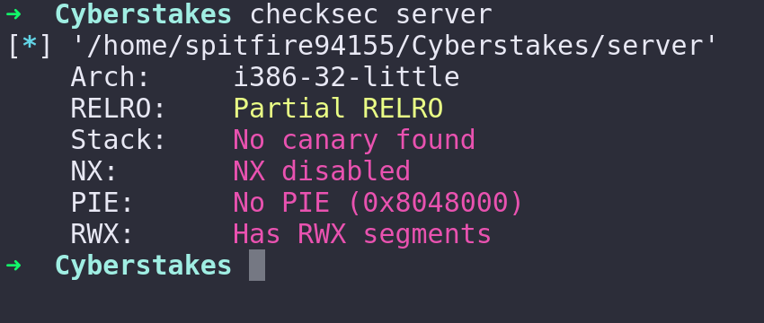

# Hulk Smash - Points: 100

### Description:

Our recon team has identified a service running on a developer's computer that they forgot to lock down! See if you can smash it! Access the developer computer here: nc challenge.acictf.com 31813 Grab the server binary for inspection and debugging. This might help as well? source

### Hints

 - Hulk want smash stack.
 - The server with which you're communicating implements a simple binary protocol. How does it work?
 - What does the server do with the input it receives?
 - What does the server take for granted that it shouldn't? Can you control anything?
 - This challenge doesn't implement many modern protection mechanisims. DEP, Stack canaries, and PIE are disabled.

### Solution
Written by [Spitfire55](https://github.com/spitfire55/cyberstakes-2018-writeups)

#### Introduction

Hulk Smash is a great challenge for people new to binary exploitation in capture-the-flag competitions. My peers and co-workers who were first-time competitors in Cyberstakes would ask "Where do I begin? How do I learn binary exploitation?". I recommended that they spent their time trying to Hulk Smash. It is a beginner level binary exploitation problem that does a great job of providing enough complexity to simulate real-world binary protocols, but simple enough to teach the fundamentals techniques of exploiting stack-based buffer overflows to gain control of EIP and execute shellcode.

#### First Steps

For me, first step of any binary exploitation challenge is to run `checksec`. Checksec is a Python script provided by Pwntools to quickly identify which security features are enabled in a specific executable. Given that this is a beginner challenge, all security features such as address space layout randomization (ASLR), stack canaries, and non-executable stack are disabled. Below is the output of the command: 

The next step is looking at the provided source code [server.c](server.c). The source code is fairly simple to understand if you are familiar with C. The `main` function is always called first. `main` calls `serverFunc`, and `serverFunc` starts a while loop that continuously executes `doHeartbeat` as long as `doHeartbeat` doesn't return one (any non-zero value in C is equivalent to true, which is why the loop has a `!` operator).

The comment above the `doHeartbeat` function states the expected format for user input. If the first five letters are not HELLO, the program will immediately exit. After it reads HELLO, it starts to read stdin into a buffer that has allocated 300 bytes onto the stack.

#### Vulnerability

The vulnerability in this program is that the `recvUntilNull` function does not check to make sure that the user has written less than 300 bytes to stdin and doesn't stop reading stdin after 300 bytes. This means that our user input could be HELLO followed by more than 300 bytes of data and the code will write that data onto the stack, overwriting any data outside of the 300 byte buffer. We can use this to overwite the instruction pointer `EIP` and gain control of the execution of the program.

#### Exploit

A great feature of pwntools is the `cyclic` function. This function generates a character permutation of a specific length. We can use the output of this program to find the exact offset in our input that overwrites `EIP`. For my exploit, I write HELLO, followed by three bytes `\x000\x00` (these three bytes aren't actually necessary, but whatever...), and then 321 bytes of cyclic data ending with a null byte `\x00`. I initially put in around 400 bytes of cyclic data, and the program crashed due to `EIP` being overwritten with an invalid address. I took this address and passed it as an argument to the `cyclic_find` program, which is a complimentary pwntools function to find the offset in the output of `cyclic`.

Once I knew the offset of my input that overwrites `EIP`, the next step is finding a way to execute arbitrary code that give me a remote shell on the system. Given that the stack is executable, I needed to find the address of a `JMP ESP` instruction in the binary. Luckily this instruction existed in the binary at the address `0x08048667`. Since x86 is a little-endian architecture, we will need to append this address to our input in little-endian order `\x67\x86\x04\x08`.

The final step is to put shellcode at the end of our input. This shellcode will reside at the start of the stack once the call to `JMP ESP` occurs, granting us full control of the execution flow of the program. Pwntools makes this very easy to do as long as we correctly specify the OS (_Linux_)and architecture (_i386_)in the beginning of our script. We can append the output of `shellcraft.sh()` to our payload and it will automatically generate shellcode that, once executed, gives us a remote shell by calling `system(/bin/sh)`.

Finally, we call `r.interactive()` in the pwntools script to be able to interact with the local process or remote socket and run commands. To get the flag, simply run `cat flag.txt`.

