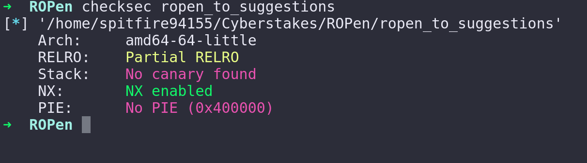
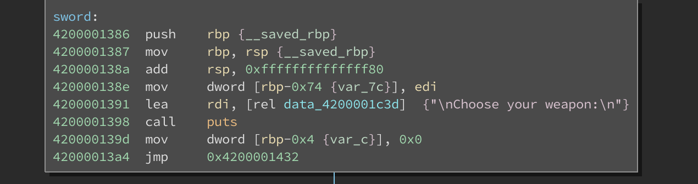
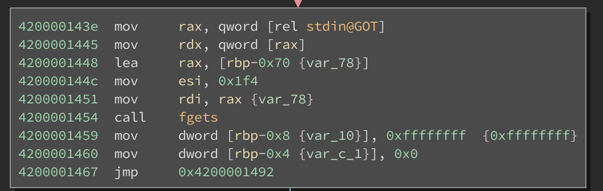

# I'm ROPen to Suggestions

## Binary Exploitation - 125 points

### Description

We've identified another vulnerable service running on a developer's computer.
This one seems to be built modularly, and resistant to smashing!

### Hints

- Have you seen where the games get loaded at?
- The challenge is 125 points; the bug is not esoteric or hard to understand.

### Introduction

Written by [Spitfire55](https://github.com/spitfire55/cyberstakes-2018-writeups)

This challenge contains the main `ropen_to_suggestions` binary, nine shared
objects for each game, and a copy of libc. The overall design of the challenge
is simulating the classic [WarGames](https://en.wikipedia.org/wiki/WarGames)
computer "game" terminal. Each game option is an independent shared object that
is dynamically loaded and called at runtime.

### Static Analysis

First step is running `checksec`. The binary has a non-executable stack, but
ASLR and stack canaries are turned off. Given the name of the challenge and the
point value, we will probably need to build a simple ROP chain once we find the
vulnerability.

The next step is opening `ropen_to_suggestions` in Binary Ninja. After looking
around for a while for the vulnerability in the main binary and nine shared
objects, I finally found a buffer overflow vulnerability in the `fighter.so`
object. At the start of the `sword` function, we see the call to
`add rsp, 0xffffffffffffff80`, which, due to integer overflow, is effectively
subtracting `0x7f` bytes from `rsp` as stack space for this function.

Later on in the binary, we see a call to
[fgets](https://www.tutorialspoint.com/c_standard_library/c_function_fgets.htm)
that passes `0x1f4` as the maximum number of bytes to read from standard input.
Since this value is larger than the stack space allocated, we have a standard
stack-based buffer overflow vulnerability.

In order to get to this point in the binary, we need to send the following
responses to the prompts:

| Prompt                                                                                                                                                                                                                                                              | Response                         |   |   |   |
|---------------------------------------------------------------------------------------------------------------------------------------------------------------------------------------------------------------------------------------------------------------------|----------------------------------|---|---|---|
| GREETINGS PROFESSOR FALKEN                                                                                                                                                                                                                                          | \n                               |   |   |   |
| HOW ARE YOU FEELING TODAY?                                                                                                                                                                                                                                          | \n                               |   |   |   |
| EXCELLENT. IT'S BEEN A LONG TIME. CAN YOU EXPLAIN THE REMOVAL OF YOUR USER ACCOUNT ON JUNE 23 1973.                                                                                                                                                                 | PEOPLE SOMETIMES MAKE MISTAKES\n |   |   |   |
| YES THEY DO.  SHALL WE PLAY A GAME?  0) EXIT 1) CHESS 2) TIC-TAC-TOE 3) FIGHTER COMBAT 4) GUERRILLA ENGAGEMENT 5) DESERT WARFARE 6) AIR-TO-GROUND ACTIONS 7) THEATERWIDE TACTICAL WARFARE 8) THEATERWIDE BIOTOXIC AND CHEMICAL WARFARE  9) GLOBAL THERMONUCLEAR WAR | 3\n                              |   |   |   |
| How would you like to fight? 0) with words 1) slap 2) hand-to-hand 3) knife fight 4) sword fight 5) guns  6) Return to Main Menu                                                                                                                                    | 4\n                              |   |   |   |
| Choose your weapon:  U) Unarmed A) A well-thought-out argument D) Dagger F) Fist H) Hunting knife I) Kitchen knife K) Katana O) Open Hand P) Pocket knife S) Saber                                                                                                  | D3 + payload + \n                |   |   |   |

### Dynamic Analysis

Now that we have identified the vulnerability, we need to gain control of `rip`
to control the execution flow.
[Pwntools](http://docs.pwntools.com/en/stable/index.html) makes this process
very painless. First, we use the `cyclic` function to find the number of bytes
needed to overwrite `rip`. We identify that, after entering the necessary input
outlined above, we gain `rip` control after 118 bytes.

Next step is figuring out which instructions available to us in `libc.so`,
`fighter.so`, and `ropen_to_suggestions` will allow us to execute our shellcode
to get a remote shell. 

We can use pwntools to make this easy. In [the solve script](solve_ropen.py),
on lines 37-41, I do some work w/ leaking the offset of a libc function. This
isn't necessary since ASLR is turned off, but I wanted to do the work so that I
have the code already written for the other Cyberstakes pwn challenges. The actual
work to build a ROP chain is on lines 70-72. We call the pwntool's `ROP`
function on libc to automatically analyze the binary and prepare to build a ROP 
chain. Then we call the `search` function to find the address where the string
`/bin/sh` is located in the libc file. This is then passed as an argument
to the `system` function, which automatically locates and calls the function
within libc. Pwntools makes it very easy to build a simple `system('bin/sh')`
ROP chain by defining these functions.

The rest of the script should be pretty self-explanatory. When you run it
against the remote service, you gain control of the execution and spawn a
shell. If you run `cat flag.txt`, you will get the flag!