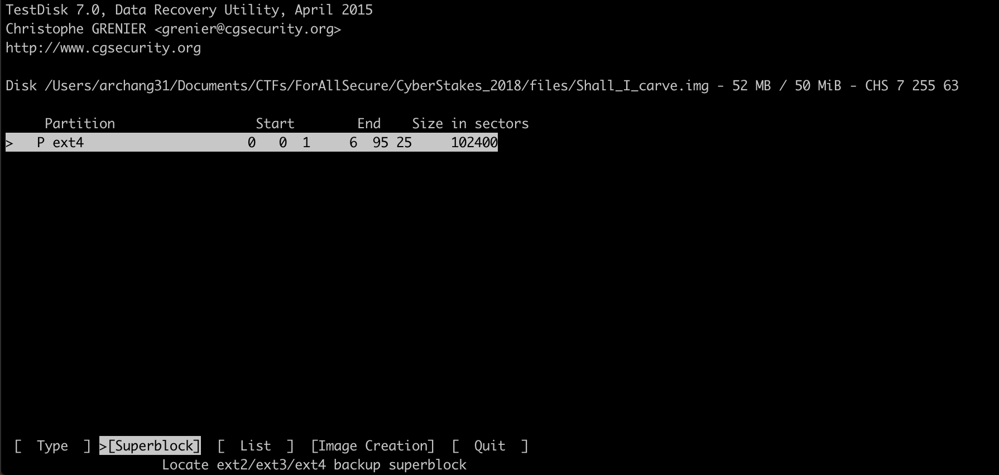
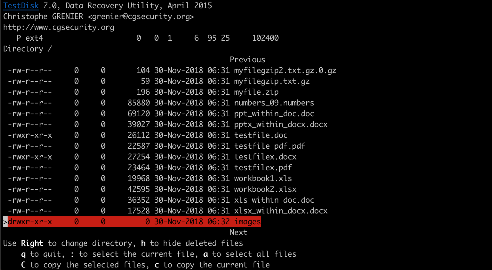
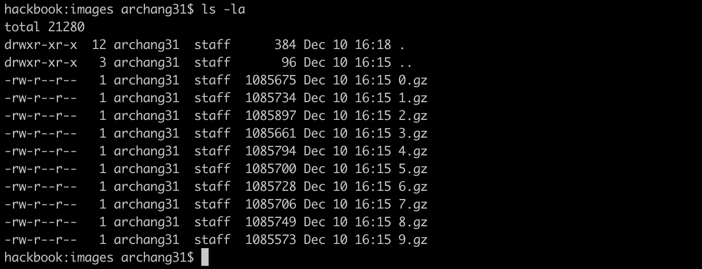
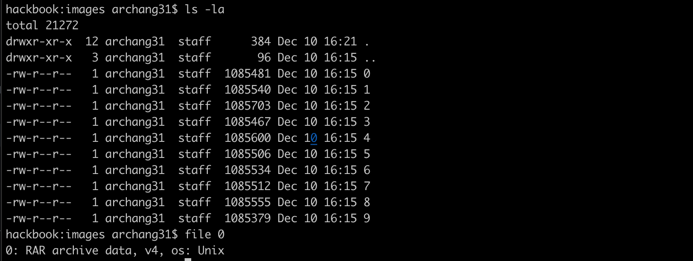

# Shall I Carve - Points: ???

### Description:

<missing since site is down>

### Hints

<missing since site is down>

### Solution
TLDR: This challenge is a simply use case of extundelete followed by a walk through a ton of compression utilities. Then grep for the flag.

So I started by looking at this image in testdisk. As seen in the below screenshot, I saw that the partition was ext4 and there was a deleted images directory, but I could not recover this directory with testdisk.

Time to use extundelete as hinted by the challenge. I already knew the directory so I recovered it with the command:
`extundelete Shall_I_carve.img --restore-directory images`

You could also just do everything if you did not know the directory you wanted
`extundelete Shall_I_carve.img --restore-all`

These commands will recover the deleted images directory. This directory contains 10 .gz compressed files from 0-9.

Lets uncompress.
`for i in {0..9}; do gunzip $i.gz; done`

This results in ten new files from 0 to 9 of an unknown type. Using `file`, you can see these are .rar files.

`for i in {0..9}; do unrar e $i; done`

Now you have .zip.
`for i in {0..9}; do unzip $i.zip; done`

Then .lzma.
`for i in {0..9}; do unlzma $i.lzma; done`
**Note: unlzma is equivalent to xz --format=lzma --decompress**

Then .7z.
`for i in {0..9}; do 7z e $i; done`

Then .xz.
`for i in {0..9}; do unxz $i.xz; done`
**Note: unxz is equivalent to xz --decompress.**

Then .bz2
`for i in {0..9}; do bzip2 -d $i; done`

Then .gzip. Notice, then using `file` this time it says:
`0.out: gzip compressed data, was "0.tar", last modified: Fri Nov 30 12:31:52 2018, from Unix, original size 1048576`

So we know the output was previous a .tar file. To make life easy, lets rename these files:
`for i in {0..9}; do do mv $i.out $i.tar.gz; done`

`for i in {0..9}; do gunzip -d $i.tar.gz; done`

Using file, we see these .tar files are actually data. Lets look for the flag
`strings ./* | grep ACI`

### Flag: `ACI{4f66aecdfd4aee0618edf490830}`
