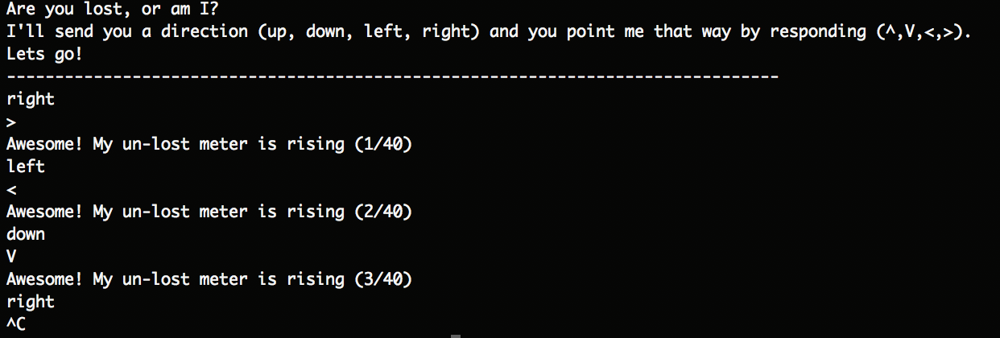

# So Lost - Points: 10

### Description:

Looks like you've hit the end of the #Tutorial. As you head off into the rest of the competition prove you're not lost. The service is listening at challenge.acictf.com:31802 and will send you directions (up, down, left, right). All you have to do is recognize the direction and respond with the corresponding character (^,V,<,>).

### Hints

 - For many challenges you will have to perform some form of interaction with a service.
 - Often a simple scripting language like python is a good place to start writing a client.
 - Libraries like pwntools can make your job much easier

### Solution

Using nc, I connected to the perscribed service to observe its behavior in order to begin understanding how to write the client.

This seems pretty straightforward. And it is.

See my solution [here](src.py).

### Flag: `ACI{0ab74b9759bc22f4ee07718cd2f}`

