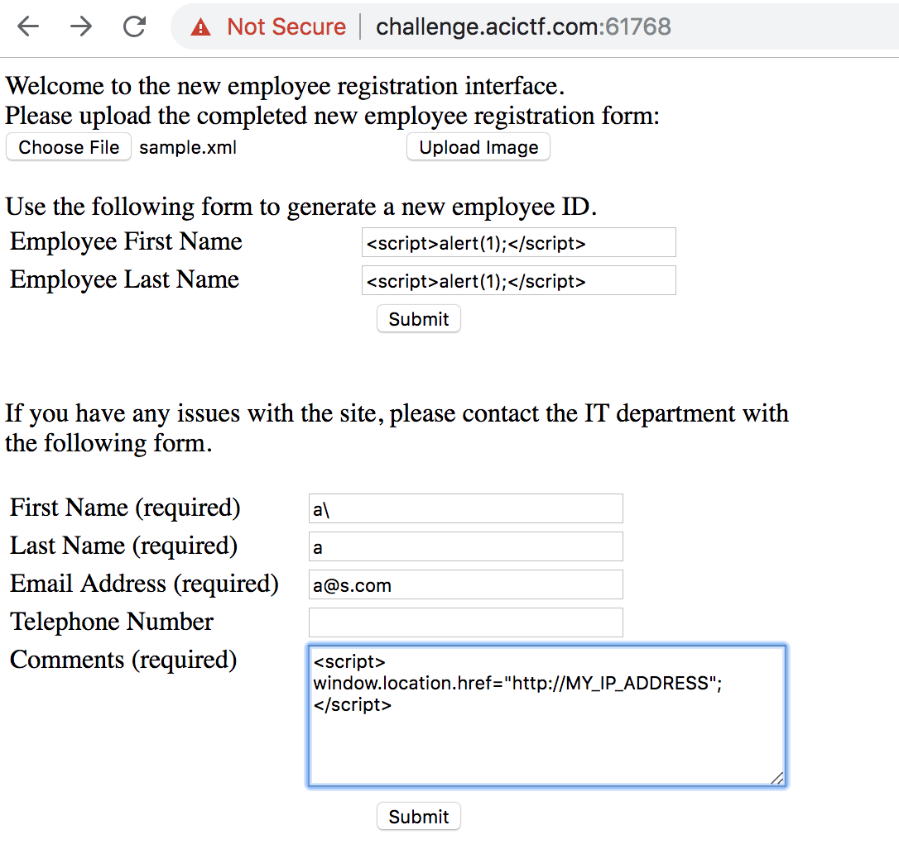
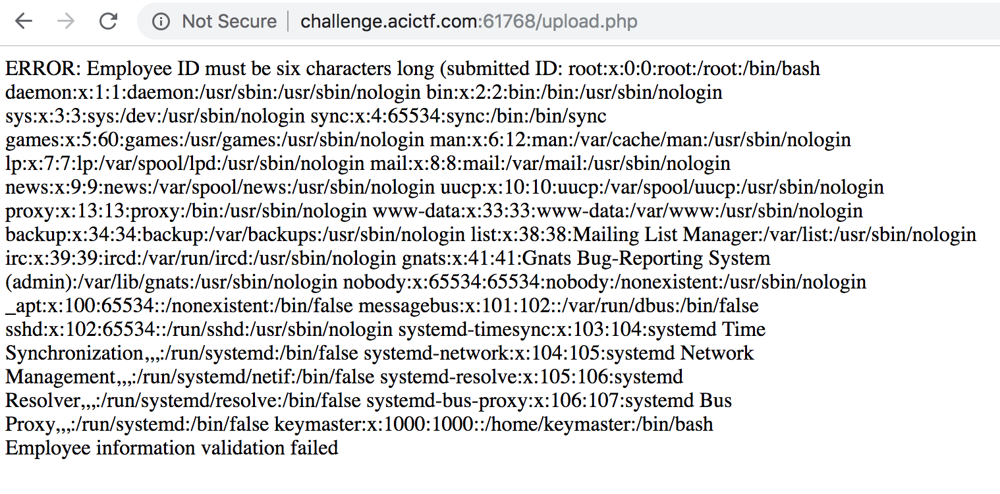

# Whooo am I? Who who who who? - Points: 300 

### Description:

You can always find your shadow. Download server access information: [server_info](files/server_info), Sample employee registration file: [sample.xml](files/sample.xml)

### Hints

 - First, you need to find the vulnerability.
 - Then you need to decide what to do with it. How about finding user/pass?
 - These are some pretty bad passwords... https://download.openwall.net/pub/wordlists/languages/English/

### Solution

Sigh... a hash cracking challenge. For 300 points. I'm *very* disappointed by this. Anyway, how do I know it's a hash cracking challenge? The hints mention finding some username / passwords, and then we're provided a link to wordlists. That's how.

Knowing that we are to recover passwords of some sort, I poke around the site and its endpoints to try to figure out where these passwords are stored. All trivial attempts at sql injection fail, but there also doesn't appear to be any relevant user passwords anyway. 

After I was satisfied that there was not a trivial sqli, I looked at the `contact the admin` form. These types of forms usually lead to xss of some sort. Without any of our inputs reflected to the page anyway, I did some blind attempts at using xss to steal an admin session (if there even is one).

How did I do this?

I monitored the logs of a public server that I control while sending xss payloads to the admin. 

Nothing was ever accessed.. so we can now rule out trivial xss.

Looking the provided sample [xml file](files/sample.xml), nothing jumps out as suspicious. However, xml parsers are notoriously weak and vulnerable. After messing with the parameters for a few minutes, it appears that they are validated and the only thing ever reflected to the page is the employee ID in an error message. Let's see if we can attack the xml parser to conduct a trivial [xxe](https://www.owasp.org/index.php/XML_External_Entity_(XXE)_Processing) attack, leaking file contents out via that error message on the employee ID.

It turns out, this works easily. Using the following xml file:

    <!DOCTYPE GVI [<!ENTITY xxe SYSTEM "file:///etc/passwd" >]>
    <xml>
        <firstname>Michael</firstname>
        <lastname>Scott</lastname>
        <contactnumber>4573097878</contactnumber>
        <position>Regional Manager</position>
        <department>MNG</department>
        <supervisor>David Wallace</supervisor>
        <address>123 Fake Street</address>
        <city>Scranton</city>
        <state>PA</state>
        <zipcode>12345</zipcode>
        <!-- Optional entry <age></age> -->
        <empid>&xxe;</empid>
    </xml>

we get this result:

Nice. We can recover the shadow file too.

Looking at the shadow file, there are 2 users with passwords - `root` and `keymaster`. `keymaster` doesn't usually have a shadow entry, which is suspicious, but whatever. Using `john`'s `unshadow` and ultimately loading the result into `john` to get cracked, we realize that the `root` password hash is of an invalid format. But that doesn't matter since we will presumably be able to `ssh` in as `keymaster` if we an crack that user's hash.

After concatenating all of the wordlists at the link provided in the hints together, I run `john`, and get a hit for the `keymaster` hash. His password? `freckleproof`. Nice.

SSH in using the other port provided in the server info with `keymaster:freckleprood` and `flag.txt` is right there in the home folder.

### Flag: `ACI{ca5931e0c1660cb36cf9591aa1a}`

